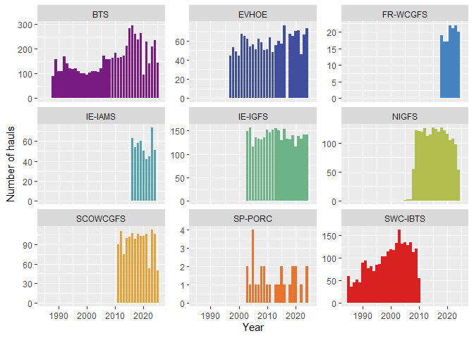
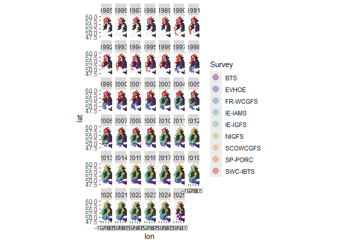
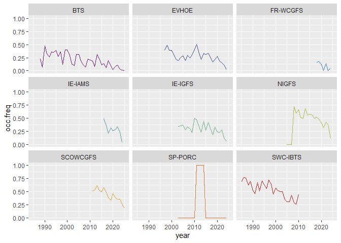
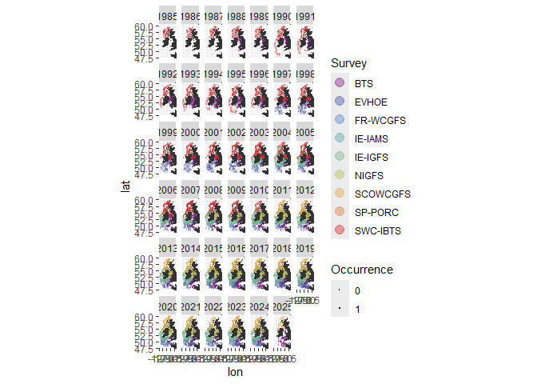
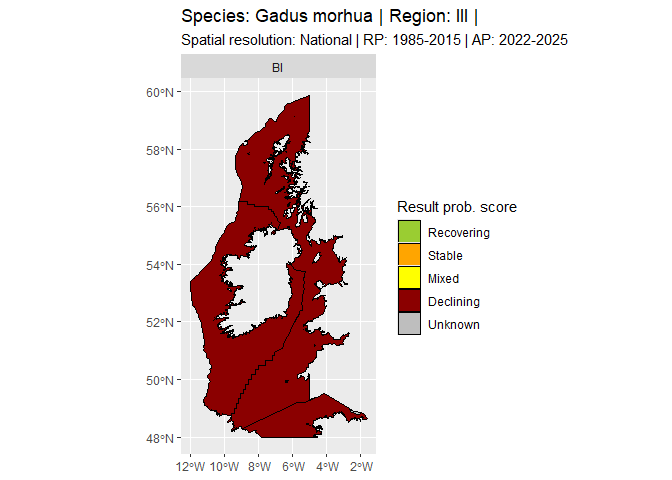
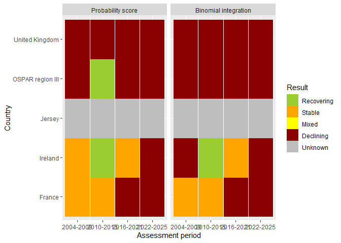

An introduction to calculating FC-1
================
W.Nikolaus Prost
2026-09-24

## Update of the OSPAR FC-1

This is a collection of functions to calculate the occurrence of
sensitive fish species indicator by OSPAR based on the OSPAR Quality
Status Report 2023. The code is based on the idea of assessing the
frequency of species’ occurrences of in survey hauls as suggested by
Probst et al. (2023). This code is prepared for the OSPAR Intermediate
Assessment 2027. New features include:

- Besides the binomial integration as described by Probst et al. (2023),
  the implementation of a new integration method for combining
  assessment outcomes from multiple surveys based on an average
  probability of an assessment outcome weighted by the proportion of
  hauls included.
- The possibility to perform assessments by region (OSPAR regions I-V)
  or separately by countries within an OSPAR region.
- A function for conducting assessments across multiple assessment
  periods.

## References

Lynam, C. P., Bluemel, J. K., and Probst, W. N. 2022. Recovery of
Sensitive Fish Species. In: The 2023 Quality Status Report for the
Northeast Atlantic, 19 pp. OSPAR Commission, London.

OSPAR. 2023. OSPAR Quality status report 2023.

Probst, W. N., Lynam, C. P., Bluemel, J. K., and Clarke, M. 2023.
Assessing change in the occurrence of rare species using the binomial
distribution. Ecological Indicators, 156.

## To get started

Install the folders ‘scripts’ and ‘spatial data’ onto your local
computer. You also might need to install obus and dependent packages
(e.g. ‘DuckDB’):

remotes::install_github(“<einarhjorleifsson/obus@2a6c1f64ce0fda8c0167888488ae129b29e1e0f6>”)

For info see ices-tools-prod/icesDatras#32

Then you should be able to use the functions from the folder ‘scripts’

``` r
# Load some packages
library(magrittr);library(reshape);library(tidyverse);library(data.table)
library(sf);library(raster);library(terra)
library(ggplot2);library(patchwork);library(ggpubr);library(pals);library(crayon)
library(worrms)     
library(mapplots)
library(obus)

# Source functions ----
source("./scripts/datras.hh.R")
source("./scripts/datras.merge.hhhl.R")
source("./scripts/boa.wrk.hrs.R")
source("./scripts/boa.asmnt.R")
source("./scripts/period.asmnt.R")
source("./scripts/boa.spatial.R")
source("./scripts/ovrvw.spc.R")
source("./scripts/ovrvw.hh.R")

# Load EEZ & OSPAR data
eezs.15<-read_sf("./spatial data/eezs.ospar.regions.shp")
ospar.regs<-read_sf("./spatial data/ospar_regions_simplified.shp")

# Examples of command chain ----
# Get all hauls from all surveys in OSPAR region III
# Need to do this once per region, than can be merged separately for each species
hh.iii.dat<-read_sf("./test data/hh.iii.dat.shp")

# Explore number of hauls and spatial extent
ovrvw.hh.iii<-ovrvw.hh(hh.iii.dat)

# Plot annual number of hauls per survey
ovrvw.hh.iii$n.hauls %>% 
  as.data.frame %>%
  mutate(year=Var1 %>% as.character %>% as.numeric) %>%
  ggplot(aes(x=year,y=Freq,fill=Var2))+
  geom_col(show.legend=F)+
  facet_wrap(.~Var2,scales="free_y")+
  scale_fill_discrete(palette=pals::tol.rainbow)+
  labs(x="Year",y="Number of hauls")
```

<!-- -->

``` r
# Plot spatial coverage of hauls per year
ovrvw.hh.iii$spatial.overview
```

<!-- -->

``` r
# Merge with abundance/occurrence data for cod
cod.iii<-read.csv("./test data/cod.iii.csv",header=T)
cod.iii[1:3,]
```

    ##                            haul.id year quarter survey  gear ospar.region
    ## 1 BTS:1988:3:GB:74RY:BT4AI:102:277 1988       3    BTS BT4AI          III
    ## 2 BTS:1988:3:GB:74RY:BT4AI:103:279 1988       3    BTS BT4AI          III
    ## 3 BTS:1988:3:GB:74RY:BT4AI:104:281 1988       3    BTS BT4AI          III
    ##          country ices.rect hauldur     lon     lat      species total.n occ
    ## 1 United Kingdom      32E5      15 -4.4833 51.6650 Gadus morhua       0   0
    ## 2 United Kingdom      32E5      15 -4.4150 51.6300 Gadus morhua       0   0
    ## 3 United Kingdom      32E5      15 -4.3783 51.5833 Gadus morhua       0   0

``` r
# Assess binomial occurrence (BOA) for cod for all countries in OSPAR Region III
cod.iii.nat<-boa.asmnt(boa.dat=cod.iii,
                       rp=1985:2015,
                       ap=2022:2025,
                       rgnl=F)

cod.iii.nat$integrated.prob.score
```

    ##   ospar.region        country      species   ref.per asmnt.per res.final
    ## 1          III         France Gadus morhua 1985-2015 2022-2025 Declining
    ## 2          III         France Gadus morhua 1985-2015 2022-2025   Unknown
    ## 3          III        Ireland Gadus morhua 1985-2015 2022-2025 Declining
    ## 4          III        Ireland Gadus morhua 1985-2015 2022-2025    Stable
    ## 5          III        Ireland Gadus morhua 1985-2015 2022-2025   Unknown
    ## 6          III         Jersey Gadus morhua 1985-2015 2022-2025   Unknown
    ## 7          III United Kingdom Gadus morhua 1985-2015 2022-2025 Declining
    ##   mean.prob hls.prob prob.score res.fl
    ## 1   0.00000  0.20238    0.00000      1
    ## 2   0.00000  0.79762    0.00000      0
    ## 3   0.14648  0.97882    0.14338      1
    ## 4   0.27273  0.01664    0.00454      0
    ## 5   0.00000  0.00454    0.00000      0
    ## 6   0.00000  1.00000    0.00000      1
    ## 7   0.18090  1.00000    0.18090      1

``` r
# BOA assessment for cod for entire region III
cod.iii.reg<-boa.asmnt(boa.dat=cod.iii,
                       rp=1985:2003,
                       ap=2016:2021,
                       rgnl=T)

# Get an overview on data coverage for cod
ovw.cod.iii<-ovrvw.spc(cod.iii)
ovw.cod.iii$n.hauls
```

    ##       
    ##        BTS EVHOE FR-WCGFS IE-IAMS IE-IGFS NIGFS SCOWCGFS SP-PORC SWC-IBTS
    ##   1985   0     0        0       0       0     0        0       0       59
    ##   1986   0     0        0       0       0     0        0       0       35
    ##   1987   0     0        0       0       0     0        0       0       45
    ##   1988  89     0        0       0       0     0        0       0       51
    ##   1989 159     0        0       0       0     0        0       0       45
    ##   1990 109     0        0       0       0     0        0       0       89
    ##   1991 110     0        0       0       0     0        0       0       94
    ##   1992 170     0        0       0       0     0        0       0       76
    ##   1993 142     0        0       0       0     0        0       0       81
    ##   1994 121     0        0       0       0     0        0       0       70
    ##   1995 119     0        0       0       0     0        0       0       84
    ##   1996 121     0        0       0       0     0        0       0       86
    ##   1997 110    44        0       0       0     0        0       0      103
    ##   1998 101    53        0       0       0     0        0       0      103
    ##   1999 101    49        0       0       0     0        0       0      114
    ##   2000  96    44        0       0       0     0        0       0      119
    ##   2001 103    67        0       0       0     0        0       0      118
    ##   2002 108    65        0       0       0     0        0       0      133
    ##   2003 108    62        0       0     149     0        0       2      163
    ##   2004 107    54        0       0     157     0        0       1      131
    ##   2005 121    56        0       0     116     1        0       4      135
    ##   2006 173    51        0       0     135     2        0       1      129
    ##   2007 159    62        0       0     133     2        0       1      135
    ##   2008 158    58        0       0     131    54        0       2      112
    ##   2009 164    50        0       0     135   122        0       2      120
    ##   2010 182    51        0       0     152   121        0       1       54
    ##   2011 163    63        0       0     146   120       90       1        0
    ##   2012 167    48        0       0     152   126      111       0        0
    ##   2013 172    55        0       0     156   112       75       1        0
    ##   2014 213    60        0       0     150   115      100       1        0
    ##   2015 284    57        0       0     130   127      102       2        0
    ##   2016 295    76        0      63     153   124      108       1        0
    ##   2017 260     0        0      54     133   120       99       0        0
    ##   2018 238    67       19      58     131   127      106       1        0
    ##   2019 263    65       17      60     140   122      103       2        0
    ##   2020  96    70       17      50     116   116      103       2        0
    ##   2021 228    71       22      42     139   105      106       0        0
    ##   2022 141    46       21      45     132   107       53       1        0
    ##   2023 208    66       22      74     142    97      113       0        0
    ##   2024 233    73       20      51     141    53      106       2        0
    ##   2025 143     0        0       0       0     0       50       0        0

``` r
ovw.cod.iii$occ.freq.plot
```

<!-- -->

``` r
ovw.cod.iii$spatial.overview
```

<!-- -->

``` r
# Spatial plots
boa.spatial(cod.iii.nat,"bi")
```

<!-- -->

``` r
# Assess cod in Region III across multiple periods
cod.iii.per<-period.asmnt(boa.dat=cod.iii,
                         rp=1985:2003,
                         asp=list(2004:2009,2010:2015,2016:2021,2022:2025))
```

    ##   |                                                                              |                                                                      |   0%  |                                                                              |==================                                                    |  25%  |                                                                              |===================================                                   |  50%  |                                                                              |====================================================                  |  75%  |                                                                              |======================================================================| 100%

``` r
cod.iii.per$summary.plot
```

<!-- -->
